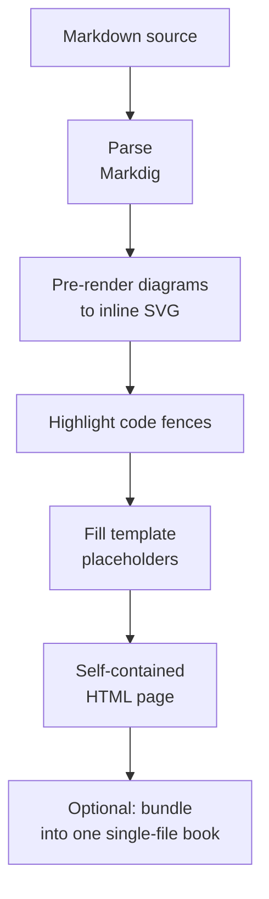

How mdbook builds a page
================================

This page explains what happens inside `mdbook` between a Markdown source file
and the self-contained HTML you open. You do not need any of this to use the
tool — it is here for the curious, and for anyone extending it.

The transformation, end to end
----------------------------------------------------------------

Point `mdbook` at a file or folder and each page travels through the same
sequence of steps:

Step by step
----------------------------------------------------------------

- **Parse.** The Markdown is parsed by [Markdig](https://github.com/xoofx/markdig)
  into a document tree, with the extensions listed in
  [Getting started](getting-started.en.md) (tables, task lists, auto
  identifiers, and the rest).
- **Pre-render diagrams.** Fenced blocks tagged with a diagram language
  (`mermaid`, `plantuml`, …) are turned into inline SVG *before* the page is
  written — see the two-phase note below. With no renderer configured, the block
  is left as plain text. See [Diagrams](diagrams.en.md).
- **Highlight code fences.** Ordinary code blocks are syntax-highlighted, and the
  matching CSS is emitted into the template's `<style>` so the colours travel
  inside the file.
- **Fill template placeholders.** The rendered HTML, the title, the language and
  the rest are substituted into the chosen template's `{{{…}}}` slots. See
  [Templates and placeholders](templates.en.md).
- **Write a self-contained page.** The result is one HTML file — inline CSS, no
  CDN, no server — written next to the source (or into `--Export`). Local `.md`
  links are rewritten to `.md.html`, and linked assets (images, downloads) are
  copied alongside.
- **Optionally bundle.** With `--Single-File`, every page is combined into one
  HTML document with a table of contents. See
  [Single-file books](single-file.en.md).

Why diagrams are rendered in a separate pass
----------------------------------------------------------------

Rendering a diagram is slow and may reach outside the process — a Docker
container or a Kroki server — whereas Markdig's own rendering is synchronous and
in-memory. The two do not mix well, so `mdbook` uses **two phases**: first an
asynchronous pass renders every diagram on the page (in parallel, de-duplicated)
into a cache; then the normal synchronous render runs, and each diagram fence is
replaced by looking its SVG up in that cache.

The upshot is the guarantee the whole tool is built around: the *build* may pull
containers or call a server, but the *output* it produces carries no such
dependency. A finished page renders offline, forever, with nothing trailing
behind it.
